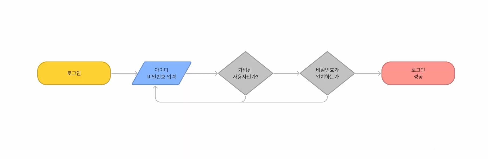
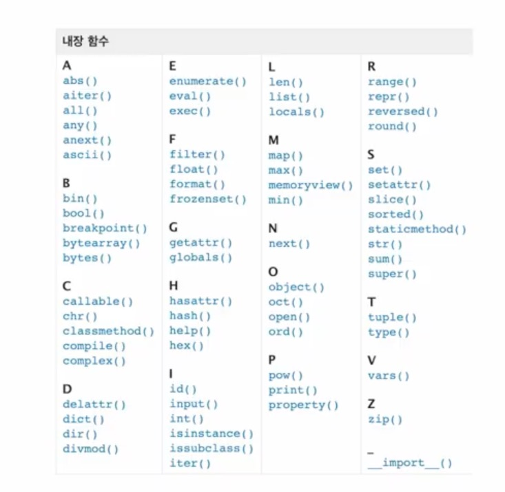

# 컴퓨터 프로그래밍 언어

## 컴퓨터

- Calculation ( 조작 )
- Remember ( 저장 )

- 선언적 지식
  - 사실에 대한 내용
- 명령적 지식
  - How-to

## Python

>특징

- Easy to learm
  -  문법이 간단하고 엄격하지않음
-  Expressive Language
   -  C나 자바로 작성할 때 보다 간경함
-  인터프리터 언어
   -  소스코드를 기계어로 변환하는 컴파일 과정 없이 바로 실행 가능
-  객체 지향 프로그래밍
   -  파이썬은 객체지향 언어이며, 모든 것이 객체로 구성되어있음

> 변수

- 컴퓨터 메모리 어딘가에 저장되어 있는 객체를 참조하기 위해 사용되는 이름
- 할당 연산자(=)를 통해 값을 할당받음
  - type()
  - id()
  ``` 
  x = 'hi'
  type(x)
  # str
  id(x)
  # 4068491

  ```
- 같은 값 , 다른 값을 동시에 할당 가능
  ```
  x = y = 1004
  x , y = 1 , 2
  ```

- x , y 값을 바꾸고 싶을 때
  ```
  x , y = 10 , 20
  x , y = y , x

> 식별자

- 파이썬 객체를 식별하는데 사용하는 이름

- 규칙
  
  - 식별자의 이름은 영문 알파벳, 언더스코어(_) , 숫자로 구성
  - 첫 글자에 숫자가 올 수 없음
  - 길이제한이 없고, 대소문자를 구별
  - 다음의 키워드(keywords)는 예약어(reserved words)로 사용할 수 없음

- 내장함수나 모듈 등의 이름으로도 만들면 안됨
  - ex ) print , def , del ...

## 자료형 ( Data Type )

> 객체와 변수

## 수치형 ( Numeric Type )

>정수(int)
- 모든 정수의 타입은 int
- 매우 큰 수를 나타낼 때 오버플로우 발생하지 않음

> 실수 (Float)
- 정수가 아닌 모든 실수는 float 타입
- 부동소수점
  - 실수를 컴퓨터가 표현하는 방법


## 불린형 ( Boolean Type )

- True / False 값을 가진 타입
  - True : 1 
  - False : 0
- 비교/논리 연산을 수행함에 있어서 활용됨

## 연산자 ( Operator )

- 산술 연산자 ( Arithmetic Operator )
  - 기본적인 사칙연산 및 수식 계산
- 복합 연산자 ( In-place Operator )
  - 연산과 할당이 함께 이뤄짐
- 비교 연산자ㅏ ( Comparison Operator )
  - 값을 비교하며 , True / False 값을 리턴함
- 논리 연산자 ( Logical Operator )
  - 논리식을 판단하여 참 (True) 과 거짓 (False)를 반환함
    - and ( 모두 동일해야함 )
    - or ( 하나만 동일해도 됨)
  
## 컨테이너 ( Container )
  
  > 정의
  - 컨테이너란
    - 여러개의 값을 담을 수 있는 것, 서로 다른 자료형 저장 가능
  - 분류
    - 순서가 있는 데이터 vs 순서가 없는 데이터
  - 시퀀스 ( 나열 )
    - 문자열
    - 리스트
    - 튜플
    - 레인지
  - 컬렉션 / 비시퀀스 ( 모음 )
    - 세트
    - 딕셔너리

## 시퀀스형 컨테이너 ( Sequence Container )
---
### 문자열 ( String Type )

- 모든 문자는 str type
- 문자열은 ' ' 나 " " 를 활용하여 표기

- 인덱싱
  - 인덱스를 통해 특정 값에 접근 가능
    - a : 0 , b : 1 , c : 2 ... 
    - s[1] => 'b'
  - 슬라이싱
    - s [2:5] => 'cde'
  - 스텝
    - s [2:5:2] => 'ce'
  - 결합
    - `A + B` 
      - AB 
  - 반복
    - `A * 3`
      - AAA
  - 포함
    - `'a' in 'apple'`
      - True
  
- Escape sequence
  - 문자열 내에서 특정 문자나 조작을 위해서 역슬래시(\)를 활용하여 구분
  - ```
    print('A \ 'B' ')
    A 'B
    print( enter \n , tab \t)
    ```

- 리스트 ( List )
  - 변경 가능한 값들의 나열된 자료형
  - 순서를 가지며 , 서로 다른 타입의 요소를 가질 수 있음
  - 대괄호[] 혹은 리스트()를 통해 생성 가능
  - 추가 
    - .append()
  - 삭제 
    - .pop()
- None
  - 없음을 나타내기 위한 것

## 파이썬 시작하기
> 코드 작성 주의 사항
- 대소문자 구분
- 띄어쓰기, 문장부호
- 들여쓰기

> 주석
- 코드에 대한 설명
- 주석으로 처리될 내용 앞에 #을 입력
- command + / 
  - 문단 주석처리
 
```
# 주석입니다
```

> 자료형 변환
- 암시적 형 변환 
  - 사용자가 의도하지 않고 , 파이썬 내부적으로 자료형을 변환 하는 경우 ( bool , Numeric type)
- 명시적 형 변환
  - int
  - float
  - str
- String Interpolation
  - f-string
  ```
  name = 'kim'
  score = 4.5
  print(f'Hello, {name}! 성적은 {score}')
  ```

---

## 제어문



> 제어문이란?
- 파이썬은 위에서부터 아래로 순차적으로 명력을 수행
- 특정상황에 따라 코드를 선택적으로 실행 하거나 반복하는 제어가 필요함

> 조건문이란?
- 조건문은 참/거짓을 판단할 수 있는 조건식과 함께 사용
- 기본형식
  - 참/거짓에 대한 조건식
    - 조건이 참인 경우 이후 들여쓰기 코드 실행
    - 이외의 경우 else 이후 들여쓰기 코드 실행
      - else 는 선택적 활용가능
    ```
    if <expression > :

    else:
    ```
    ex)
    ```
    a = -10
    if a >= 0:
        print('양수')
    else:
        print('음수')
    ## 음수
    ```
    - elif
      - 복수의 조건식 활용
  
    나쁜 예 )
    ```
    dust = int(input('미세먼지 농도는? :'))
    if 0< dust <= 30 :
        print('좋음')
    elif 30 < dust <=80:
        print('보통')
    elif 80 < dust <=150:
        print('나쁨')
    else:
        print('매우나쁨')
    ```

    좋은 예)
    ```
    dust = int(input('미세먼지 농도는? :'))
    if dust > 150 :
        print('매우 나쁨')
    elif dust > 80:
        print('나쁨')
    elif dust > 30:
        print('보통')
    else:
        print('좋음')
    print('미세먼지 확인 완료')
    ```

  - range
    - 숫자의 시퀀스를 나타내기 위해 사용
    - 기본형
      - range(n)
      - 0부터 n-1까지의 숫자의 시퀀스
    - 범위지정
      - range(n,m)
      - n부터 m-1 까지의 숫자의 시퀀스
    - 범위 및 스텝 지정 
      - range(n,m,s)
      - n부터 m-1까지 s만큼 증가시키며 숫자의 시퀀스
        - 문장 전체를 나타낼 때
          - `for i in range(len(a))`
---
## 반복문
> 종류
- for 문
  - 반복가능한 객체(string, tuple, list , range)를 모두 순회하면 종료
  ```
  a = ' apple'

  for char in a:
      print(char)

     # a
       p
       p
       l
       e
  ```
- range index

> while 문
- 반복해서 조건이 있는 문장 실행
  ```
  a = 0
  while a < 5:
      print(a)
      a = a + 1  
      #이 문장 없으면 무한반복실행
  print('끝')
  ```


> 반복문 제어
- break
  - 반복문을 종료
- continue
  - 이후의 코드 블록은 수행하지 않고, 다음 반복을 수행
  - end ' ' : 다음을 엔터가 아닌 스페이스바로 해서 가로로 출력 가능
- for -else
  - 끝까지 반복문을 실행한 이후에 else문 실행
 
---
## 함수
> 함수란?
- 정의
  - 특정한 기능을 하는 코드의 조각
- 사용이유
  - Abstraction(추상)
    - 재사옹성,가독성,생산성
      - ex
        - `name = '파이썬'`
        - `print('hypergrowth!')`
- 내장함수

  - print(*objects)
    - *objects : *은 여러 값을 무한하게 받을 수 있다.
    - sep= ' '  : 기본값이 space
    - end= ' ' : 기본값이 줄바꿈 (\n)
    - print 함수는 반환 값이 없다

  - sum()
    - () 안에 왼쪽부터 오른쪽까지의 합계
  - len()
    - 객체의 길이를 반환


 추가 주소
  - [python tutor](https://pythontutor.com/python-debugger.html#mode=edit)

