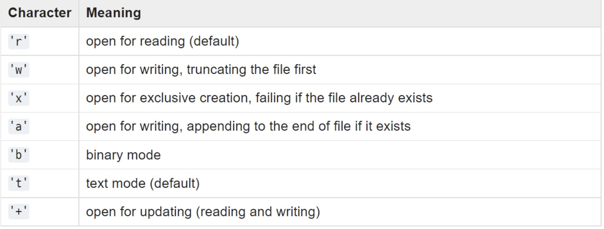

# 파일 입출력

## 파일 입력
- 파일입력
  - open(file,mode = 'r' , encoding = None)
    - file : 파일명
    - mode : 텍스트 모드
    - encoding : 인코딩 방식
      - 한글 'UTF8' 로 사용
  

- 파일 활용
  - 파일 객체 활용
  
    ``` f = open('workfile','w') ```
  - with 키워드 활용
  
    ``` 
    with open('workfile') as f:
        read_data = f.read()
    
    f.closed
    # True
    ```
  - JSON
    - 객체를 JSON으로 변환
    ```
    import json
    from pprint import pprint
    with open('data/movie.json','r',encoding = 'UTF8')
    movie = json.load(f)
    pprint(movie) # 이쁘게 나온다
    print(type(movie))
    print(movie['title'])

